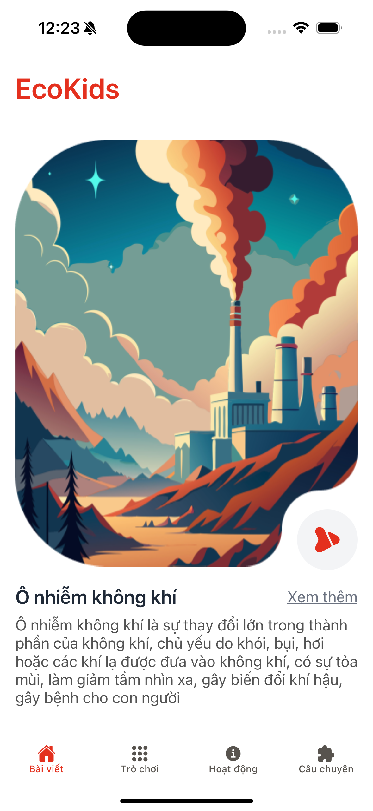
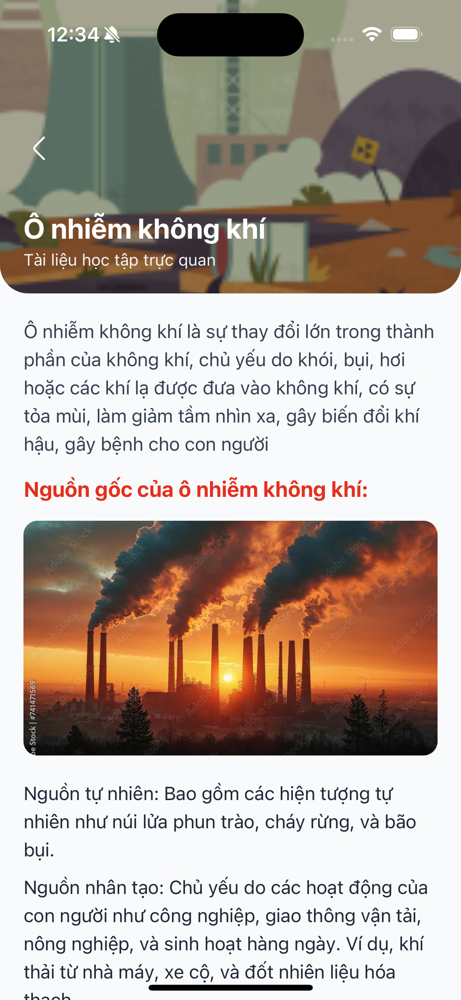
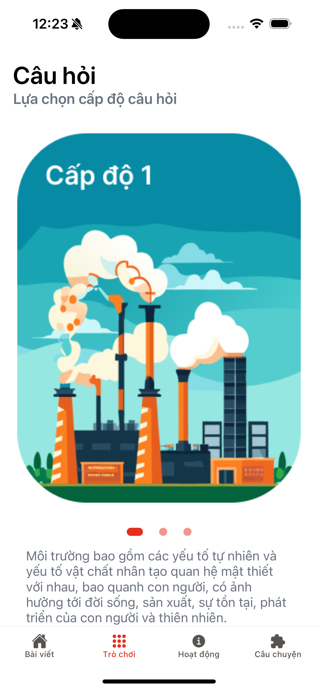
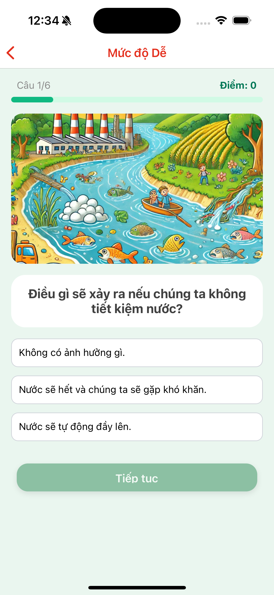
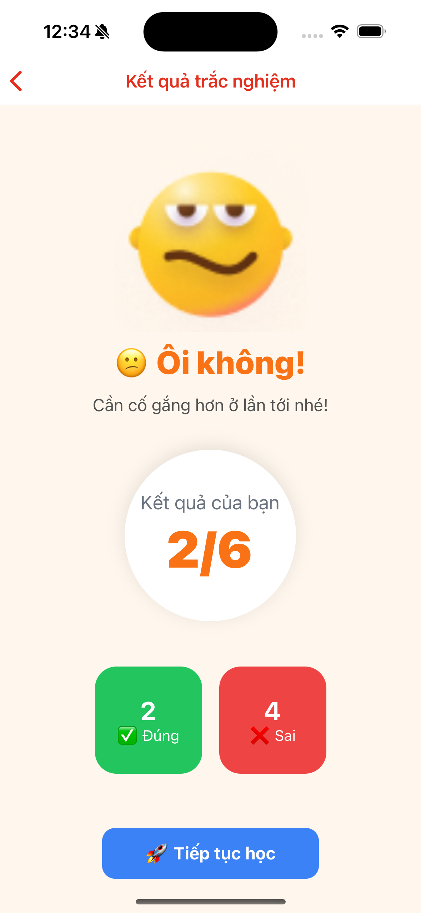
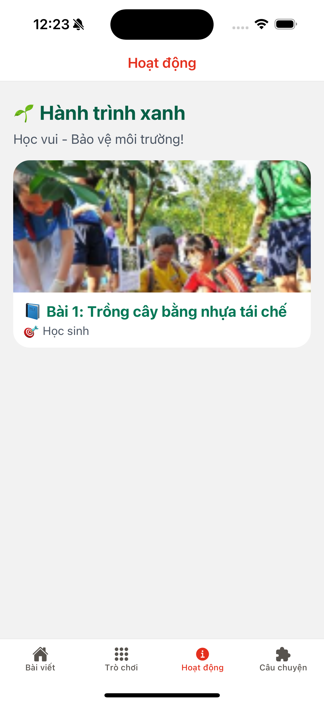
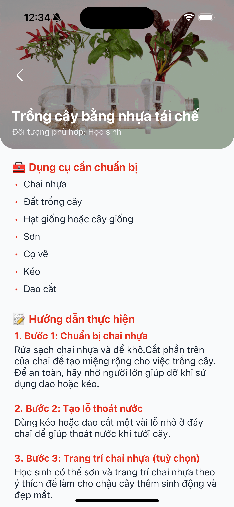
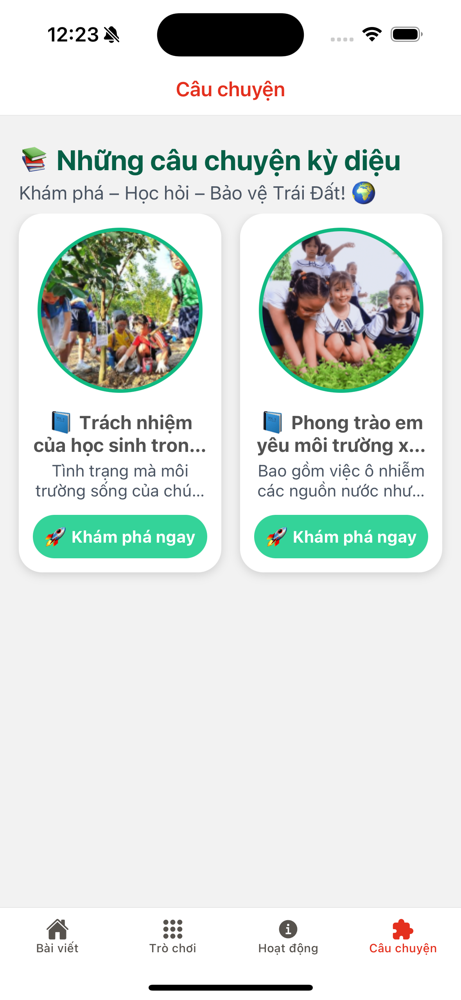
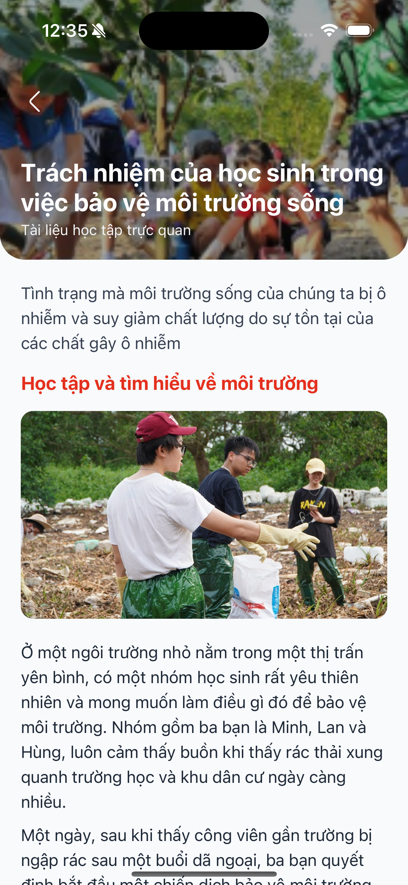

# **EcoKids – Environmental Education for Children 🌱🌏**

**EcoKids** – A fun and interactive app that teaches children how to love and protect the environment through lessons, games, and stories! 🧒👧🌍

With **EcoKids**, kids will:
- 📚 Learn about nature and sustainability.
- 🎮 Play fun, eco-themed games.
- 🧩 Explore creative green activities.
- 📖 Enjoy engaging stories about the environment.

Let’s raise a generation of little Earth heroes! 💚🌎

## [DEMO - DRIVE LINK](https://drive.google.com/file/d/1-5yl3bOMOGmXhUmD1-xhHleiz4tDUoLb/view?usp=drive_link)  
## [DOWNLOAD APK](https://drive.google.com/file/d/13Jb3rr6QWbGuMDgHj0lEQTzTheKmeFPk/view?usp=drive_link)

---

## Key Features

### 🟢 **Onboard Screens – A Friendly Green Welcome**
- 🌿 Greeted with cheerful animations and friendly characters.
- 🌍 Introduction to the app’s mission: protecting the planet together!
  

  
  
  

---

### 📘 **Lessons – Learn About the Environment**
- 🐝 Discover topics like recycling, saving water, protecting wildlife, and more.
- 🎓 Simple visuals and quizzes tailored for kids aged 4–10.
- 📊 Progress tracking to reward learning.

  
  

---

### 🎮 **Games – Play and Learn**
- ♻️ **Sort the Trash** – Help clean up by putting waste in the right bin.
- 🐢 **Ocean Rescue** – Save sea animals by cleaning up plastic pollution.
- ❓ **Eco Quiz** – Test your green knowledge and level up!

  
  
  

---

### 🎨 **Activities – Fun in Real Life**
- 🌱 Grow a plant and track its progress with photos.
- 🔁 Complete daily eco-challenges: turn off the lights, reuse paper, etc.
- 🖐️ DIY crafts using recycled materials.

  
  

---

### 📚 **Environmental Stories – Learn Through Tales**
- 📖 Read or listen to short, inspiring stories about nature, animals, and young heroes saving the Earth.
- 🧡 Stories with a moral, helping build eco-awareness and empathy.

  
  

---

## 🛠️ Technology Stack

- **React Native** – Cross-platform mobile app development.
- **Firebase** – Authentication, real-time database, and analytics.
- **Lottie Animations** – Smooth and fun animations for a kid-friendly feel.

---
